# 🗺️ Java 资深工程师 → 架构师 → 大数据工程师 学习路线图

> **当前状态**: 🚀 准备开始第 1 阶段 (Java 基础语法)  
> **总体进度**: 0% (完成 0/26 阶段)

## 📅 学习路径概览

```mermaid
graph TD
    %% 样式定义
    classDef done fill:#d4edda,stroke:#28a745,stroke-width:2px;
    classDef current fill:#fff3cd,stroke:#ffc107,stroke-width:4px;
    classDef future fill:#f8f9fa,stroke:#6c757d,stroke-width:2px,stroke-dasharray: 5 5;
    classDef architect fill:#e3f2fd,stroke:#1976d2,stroke-width:2px,stroke-dasharray: 5 5;
    classDef bigdata fill:#fff3e0,stroke:#ff9800,stroke-width:2px,stroke-dasharray: 5 5;
    classDef llm fill:#f3e5f5,stroke:#9c27b0,stroke-width:2px,stroke-dasharray: 5 5;

    subgraph "第一部分：Java 基础夯实 (6-8周)"
        P1["Phase 1: Java 基础语法"]:::current
        P2["Phase 2: 面向对象编程"]:::future
        P3["Phase 3: 集合框架"]:::future
        P4["Phase 4: IO 与 NIO"]:::future
    end

    subgraph "第二部分：Java 核心进阶 (8-10周)"
        P5["Phase 5: 并发编程"]:::future
        P6["Phase 6: JVM 深入"]:::future
        P7["Phase 7: 设计模式"]:::future
        P8["Phase 8: Spring 框架"]:::future
    end

    subgraph "第三部分：企业级开发 (10-12周)"
        P9["Phase 9: Spring Boot"]:::future
        P10["Phase 10: 微服务架构"]:::future
        P11["Phase 11: 数据库与 ORM"]:::future
        P12["Phase 12: 分布式系统"]:::future
        P13["Phase 13: 性能调优"]:::future
        P14["Phase 14: 云原生技术"]:::future
    end

    subgraph "第四部分：架构师进阶 (11-13周) 🏗️"
        P15["Phase 15: 系统架构设计"]:::architect
        P16["Phase 16: 高并发架构"]:::architect
        P17["Phase 17: 分布式存储架构"]:::architect
        P18["Phase 18: 可观测性工程"]:::architect
        P19["Phase 19: 安全架构"]:::architect
        P20["Phase 20: 架构师实战"]:::architect
    end

    subgraph "第五部分：大数据工程 (8周) 📊"
        P21["Phase 21: Hadoop 生态"]:::bigdata
        P22["Phase 22: Spark 全栈"]:::bigdata
        P23["Phase 23: Flink 实时计算"]:::bigdata
        P24["Phase 24: 数据仓库与治理"]:::bigdata
    end

    subgraph "第六部分：大模型应用 (4周) 🤖"
        P25["Phase 25: LLM 与 LangChain"]:::llm
        P26["Phase 26: RAG 与 Agent"]:::llm
    end

    P1 --> P2
    P2 --> P3
    P3 --> P4
    P4 --> P5
    P5 --> P6
    P6 --> P7
    P7 --> P8
    P8 --> P9
    P9 --> P10
    P10 --> P11
    P11 --> P12
    P12 --> P13
    P13 --> P14
    P14 --> P15
    P15 --> P16
    P16 --> P17
    P17 --> P18
    P18 --> P19
    P19 --> P20
    P20 --> P21
    P21 --> P22
    P22 --> P23
    P23 --> P24
    P24 --> P25
    P25 --> P26
```

---

## 📍 详细里程碑

### ⏳ 第一部分：Java 基础夯实 (Phase 1-4)

这一部分建立 Java 开发的核心基础。

- **Phase 1**: Java 基础语法（变量、数据类型、控制流、数组、方法）
- **Phase 2**: 面向对象编程（类、对象、继承、多态、接口、抽象类）
- **Phase 3**: 集合框架（List、Set、Map、队列、迭代器）
- **Phase 4**: IO 与 NIO（文件操作、流、NIO、序列化）

### 🔮 第二部分：Java 核心进阶 (Phase 5-8)

掌握 Java 核心技术与企业级基础。

#### Phase 5: 并发编程

- [ ] 线程创建与生命周期
- [ ] synchronized 与 Lock
- [ ] 线程池与 Executor 框架
- [ ] 并发工具类（CountDownLatch、CyclicBarrier）
- [ ] **实战**: 多线程下载器

#### Phase 6: JVM 深入

- [ ] JVM 内存模型
- [ ] 垃圾回收算法与收集器
- [ ] 类加载机制
- [ ] JVM 调优参数
- [ ] **实战**: JVM 监控与调优

#### Phase 7: 设计模式

- [ ] 创建型模式（单例、工厂、建造者）
- [ ] 结构型模式（代理、装饰器、适配器）
- [ ] 行为型模式（策略、观察者、模板方法）
- [ ] SOLID 原则
- [ ] **实战**: 设计模式实战应用

#### Phase 8: Spring 框架

- [ ] IoC 容器与依赖注入
- [ ] AOP 面向切面编程
- [ ] Bean 生命周期
- [ ] Spring MVC
- [ ] **实战**: 手写简易 Spring IoC

### 🚀 第三部分：企业级开发 (Phase 9-14)

工业级能力培养。

#### Phase 9: Spring Boot

- [ ] 自动配置原理
- [ ] Starter 机制
- [ ] Actuator 监控
- [ ] 配置中心集成
- [ ] **实战**: RESTful API 开发

#### Phase 10: 微服务架构

- [ ] 服务注册与发现（Nacos/Eureka）
- [ ] 服务网关（Gateway）
- [ ] 负载均衡（LoadBalancer）
- [ ] 服务熔断（Sentinel）
- [ ] **实战**: 微服务电商系统

#### Phase 11: 数据库与 ORM

- [ ] MySQL 高级特性
- [ ] MyBatis 与 MyBatis-Plus
- [ ] JPA 与 Spring Data
- [ ] 数据库连接池
- [ ] **实战**: 分库分表实践

#### Phase 12: 分布式系统

- [ ] Redis 缓存与分布式锁
- [ ] 消息队列（RocketMQ/Kafka）
- [ ] 分布式事务（Seata）
- [ ] 分布式 ID 生成
- [ ] **实战**: 秒杀系统

#### Phase 13: 性能调优

- [ ] JVM 性能调优
- [ ] SQL 优化
- [ ] 缓存优化策略
- [ ] 压测与性能分析
- [ ] **实战**: 系统性能优化

#### Phase 14: 云原生技术

- [ ] Docker 容器化
- [ ] Kubernetes 编排
- [ ] CI/CD 流水线
- [ ] 服务网格（Istio）
- [ ] **实战**: K8s 部署应用

### 🏗️ 第四部分：架构师进阶 (Phase 15-20)

架构师核心能力培养。

#### Phase 15: 系统架构设计

- [ ] 架构设计原则（CAP、BASE、12-Factor）
- [ ] 架构模式（分层、六边形、事件驱动）
- [ ] 领域驱动设计（DDD）
- [ ] CQRS 与事件溯源
- [ ] **实战**: 电商系统领域建模

#### Phase 16: 高并发架构

- [ ] 限流算法（令牌桶、滑动窗口）
- [ ] 降级与熔断策略
- [ ] 高可用架构（多活、容灾）
- [ ] 流量调度与负载均衡
- [ ] **实战**: 百万级并发系统设计

#### Phase 17: 分布式存储架构

- [ ] NewSQL 数据库（TiDB、CockroachDB）
- [ ] 一致性算法（Raft、Paxos）
- [ ] 数据湖与数据仓库
- [ ] 多数据源架构
- [ ] **实战**: 多数据源架构设计

#### Phase 18: 可观测性工程

- [ ] 分布式追踪（SkyWalking、Jaeger）
- [ ] 指标监控（Prometheus、Grafana）
- [ ] 日志系统（ELK Stack）
- [ ] 告警与 On-Call 体系
- [ ] **实战**: 全链路可观测平台

#### Phase 19: 安全架构

- [ ] 认证与授权（OAuth2、OIDC）
- [ ] 零信任架构
- [ ] 数据安全与加密
- [ ] 安全编码（OWASP Top 10）
- [ ] **实战**: 企业级安全架构设计

#### Phase 20: 架构师实战

- [ ] 技术选型与决策
- [ ] 架构评审方法（ATAM）
- [ ] 技术债务管理
- [ ] 团队技术管理
- [ ] **综合实战**: 从 0 到 1 设计大型系统

---

## 🏆 实战项目规划

### 资深工程师阶段

| 项目                | 对应阶段  | 核心技术点        | 状态      |
| :------------------ | :-------- | :---------------- | :-------- |
| **Java 基础练习**   | Phase 1-2 | 语法、OOP         | ⏳ 待开始 |
| **集合框架应用**    | Phase 3   | List、Map、Stream | ⏳ 待开始 |
| **多线程下载器**    | Phase 5   | 线程池、并发控制  | ⏳ 待开始 |
| **简易 Spring IoC** | Phase 8   | 反射、注解、IoC   | ⏳ 待开始 |
| **RESTful API**     | Phase 9   | Spring Boot       | ⏳ 待开始 |
| **微服务电商**      | Phase 10  | Spring Cloud      | ⏳ 待开始 |
| **秒杀系统**        | Phase 12  | Redis、MQ         | ⏳ 待开始 |
| **K8s 部署**        | Phase 14  | Docker、K8s       | ⏳ 待开始 |

### 架构师进阶阶段 🏗️

| 项目                 | 对应阶段 | 核心技术点          | 状态      |
| :------------------- | :------- | :------------------ | :-------- |
| **电商领域建模**     | Phase 15 | DDD、CQRS、事件溯源 | ⏳ 待开始 |
| **高并发系统设计**   | Phase 16 | 限流、熔断、高可用  | ⏳ 待开始 |
| **多数据源架构**     | Phase 17 | NewSQL、一致性      | ⏳ 待开始 |
| **可观测平台**       | Phase 18 | 追踪、监控、日志    | ⏳ 待开始 |
| **安全架构设计**     | Phase 19 | OAuth2、零信任      | ⏳ 待开始 |
| **大型系统架构设计** | Phase 20 | 综合架构设计        | ⏳ 待开始 |

### 大数据工程师阶段 📊

| 项目                 | 对应阶段 | 核心技术点               | 状态      |
| :------------------- | :------- | :----------------------- | :-------- |
| **日志分析系统**     | Phase 21 | HDFS、MapReduce、YARN    | ⏳ 待开始 |
| **实时数据分析平台** | Phase 22 | Spark Core/SQL/Streaming | ⏳ 待开始 |
| **实时风控系统**     | Phase 23 | Flink、CEP、状态管理     | ⏳ 待开始 |
| **企业级数仓建设**   | Phase 24 | Hive、数据湖、数据治理   | ⏳ 待开始 |

### 大模型应用开发阶段 🤖

| 项目               | 对应阶段 | 核心技术点               | 状态      |
| :----------------- | :------- | :----------------------- | :-------- |
| **智能客服机器人** | Phase 25 | LangChain4j、Prompt 工程 | ⏳ 待开始 |
| **企业知识库问答** | Phase 26 | RAG、向量库、Agent       | ⏳ 待开始 |

---

> _此路线图基于 `LEARNING_PLAN.md` 生成，随学习进度动态更新。_
